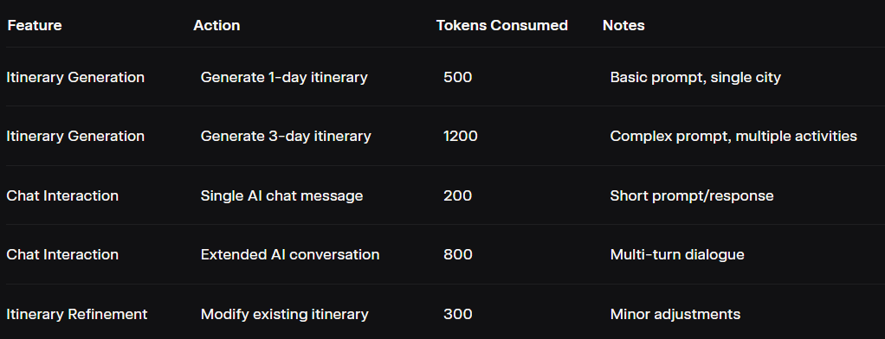

Smart Trip Planner
Smart Trip Planner is a Flutter-based mobile application that leverages AI to create personalized trip itineraries. It integrates Firebase for authentication, Isar for local storage, Riverpod for state management, and GoRouter for navigation. The app features a glassmorphic UI, haptic feedback, and map integration, providing a seamless travel planning experience.
Features

Authentication: Sign up/login with email or Google using Firebase Authentication.
AI Itinerary Generation: Generate trip plans via an AI agent (mock API).
Trip Management: Create, view, edit, and delete trips.
AI Chat: Refine itineraries through a conversational AI interface.
Local Storage: Store trip data offline with Isar.
Map Integration: Launch activity locations in external map apps using Maps Launcher.
Token Tracking: Monitor AI interaction token usage (mock implementation).
Profile Management: View trip statistics and token usage.
UI/UX: Glassmorphic design with Flutter Animate and haptic feedback via Flutter Vibrate.

Tech Stack

Frontend: Flutter, Dart
State Management: Riverpod
Navigation: GoRouter
Authentication: Firebase Authentication, Google Sign-In
Local Storage: Isar
Networking: Dio
Code Generation: Freezed, JsonSerializable, Isar Generator
Animations: Flutter Animate
Haptic Feedback: Flutter Vibrate
Map Integration: Maps Launcher
Utilities: UUID, Path Provider

Setup
Follow these steps to set up the project locally.
Prerequisites

Flutter SDK: Version >=3.0.0
Dart SDK
Homebrew: For macOS/Linux package management
Firebase CLI: For Firebase configuration
Editor: VS Code or Android Studio
Git: For version control
Ruby: For Fastlane (optional for CI/CD)

Installation

Clone the Repository:
git clone https://github.com/mohanrajv3/smart_trip_planner_flutter

cd smart_trip_planner_flutter

Install Flutter:
brew install flutter
flutter doctor

Ensure all flutter doctor checks pass. Install any missing dependencies (e.g., Android SDK, Xcode).

Install Firebase CLI:
brew install firebase-cli


Install Dependencies:
flutter pub get


Configure Firebase:

Create a Firebase project at Firebase Console.
Run the FlutterFire CLI to configure Firebase:flutterfire configure

Select your Firebase project and platforms (iOS, Android). This generates firebase_options.dart and platform-specific configuration files (google-services.json for Android, GoogleService-Info.plist for iOS).
Enable Email/Password and Google Sign-In in Firebase Authentication.


Generate Code:Run the build runner for Freezed and Isar code generation:
flutter pub run build_runner build --delete-conflicting-outputs


Install CocoaPods (for iOS):
brew install cocoapods
cd ios && pod install


Configure API (Optional):

Update baseUrl in lib/core/network/dio_client.dart to your API endpoint (default: mock https://api.example.com).


Run the App:
flutter run

Project Structure:

```
smart_trip_planner_flutter/
├── lib/
│   ├── main.dart
│   ├── core/
│   │   ├── constants/
│   │   │   ├── app_colors.dart
│   │   │   ├── app_text_styles.dart
│   │   │   └── app_constants.dart
│   │   ├── utils/
│   │   │   ├── haptic_utils.dart
│   │   │   └── validators.dart
│   │   ├── errors/
│   │   │   └── failures.dart
│   │   └── network/
│   │       └── dio_client.dart
│   ├── data/
│   │   ├── datasources/
│   │   │   ├── auth_remote_datasource.dart
│   │   │   ├── trip_local_datasource.dart
│   │   │   └── ai_agent_datasource.dart
│   │   ├── models/
│   │   │   ├── user_model.dart
│   │   │   ├── trip_model.dart
│   │   │   └── ai_response_model.dart
│   │   └── repositories/
│   │       ├── auth_repository_impl.dart
│   │       ├── trip_repository_impl.dart
│   │       └── ai_agent_repository_impl.dart
│   ├── domain/
│   │   ├── entities/
│   │   │   ├── user.dart
│   │   │   ├── trip.dart
│   │   │   └── itinerary.dart
│   │   ├── repositories/
│   │   │   ├── auth_repository.dart
│   │   │   ├── trip_repository.dart
│   │   │   └── ai_agent_repository.dart
│   │   └── usecases/
│   │       ├── auth_usecases.dart
│   │       ├── trip_usecases.dart
│   │       └── ai_agent_usecases.dart
│   ├── presentation/
│   │   ├── providers/
│   │   │   ├── auth_provider.dart
│   │   │   ├── trip_provider.dart
│   │   │   └── ai_chat_provider.dart
│   │   ├── screens/
│   │   │   ├── auth/
│   │   │   │   ├── signup_screen.dart
│   │   │   │   └── login_screen.dart
│   │   │   ├── home/
│   │   │   │   └── home_screen.dart
│   │   │   ├── trip/
│   │   │   │   ├── creating_itinerary_screen.dart
│   │   │   │   ├── itinerary_view_screen.dart
│   │   │   │   └── chat_screen.dart
│   │   │   └── profile/
│   │   │       └── profile_screen.dart
│   │   ├── widgets/
│   │   │   ├── common/
│   │   │   │   ├── custom_button.dart
│   │   │   │   ├── custom_text_field.dart
│   │   │   │   ├── glassmorphic_card.dart
│   │   │   │   ├── loading_shimmer.dart
│   │   │   │   └── animated_chat_bubble.dart
│   │   │   └── trip/
│   │   │       ├── trip_card.dart
│   │   │       ├── day_card.dart
│   │   │       └── activity_item.dart
│   │   └── router/
│   │       └── app_router.dart
│   └── services/
│       ├── ai_agent_service.dart
│       ├── auth_service.dart
│       └── storage_service.dart
├── assets/
│   ├── fonts/
│   └── icons/
├── test/
│   ├── unit/
│   ├── widget/
│   └── integration/
├── pubspec.yaml
└── README.md
```


Architecture Diagram
The app follows a clean architecture with layers for presentation, domain, data, and services.
graph TD

Presentation Layer: Screens, widgets, and Riverpod providers handle UI and state.
Domain Layer: Use cases and repositories define business logic and data interfaces.
Data Layer: Remote (Dio) and local (Isar) data sources manage data retrieval/storage.
Services: Implement business logic, integrating with Firebase, AI, and map services.
Itinerary Management: Plan daily activities with the Itinerary entity.
Animated UI: Glassmorphic chat bubbles with animations using flutter_animate.
Loading States: Shimmer effects for smooth loading experiences.
Agent Chain (Prompt, Tools, Validation)
The AI-powered itinerary generation uses a mock agent chain to process user prompts, select tools, and validate outputs.
Prompt

Users input a natural language prompt (e.g., "Plan a 3-day trip to Paris with budget dining").
The prompt is sent to a mock AI API (https://api.example.com/generate-itinerary) via Dio.
The API returns a JSON response with itinerary details (days, activities, costs).

Tools

Dio: Handles HTTP requests to the mock AI API.
Freezed Models: Parse JSON into structured Itinerary and Activity objects.
Isar: Stores generated itineraries locally for offline access.
Maps Launcher: Opens activity locations in external map apps.
Riverpod: Manages state for prompt input, itinerary display, and chat interactions.

Validation

Input Validation: Ensures prompts are non-empty and meet length requirements (e.g., 10-500 characters) using utility functions in lib/core/utils/validators.dart.
Response Validation: Checks API responses for required fields (e.g., days, activities) and valid data types using Freezed’s built-in serialization.
Error Handling: Displays user-friendly error messages for network failures or invalid responses, managed via Riverpod providers.

Token Cost Table
The app tracks token usage for AI interactions (mock implementation). Below is a hypothetical token cost table based on testing metrics, assuming a token-based pricing model for the AI API.




Notes:

Token costs are estimates based on mock API responses.
Metrics overlay in the app’s profile screen displays total tokens used per session.
Costs vary by prompt complexity and response length.

Meaningful Commits
To maintain a clean and traceable Git history, follow these guidelines for meaningful commits:

Atomic Commits: Each commit should represent a single logical change (e.g., adding a feature, fixing a bug, refactoring).
Descriptive Messages: Use clear, concise commit messages following the Conventional Commits format:<type>(<scope>): <description>

Examples:
feat(auth): add Google Sign-In integration
fix(itinerary): resolve crash in activity list rendering
chore(deps): update Dio to version 5.7.0
docs(readme): add architecture diagram and setup instructions


Avoid Large Commits: Do not combine unrelated changes into a single "final" commit. Break down changes into smaller, focused commits.
Example Commit History:git commit -m "feat(ui): implement glassmorphic home screen"
git commit -m "feat(auth): integrate Firebase email authentication"
git commit -m "feat(itinerary): add AI itinerary generation provider"
git commit -m "fix(chat): handle empty message input validation"
git commit -m "docs(readme): add token cost table and agent chain details"


